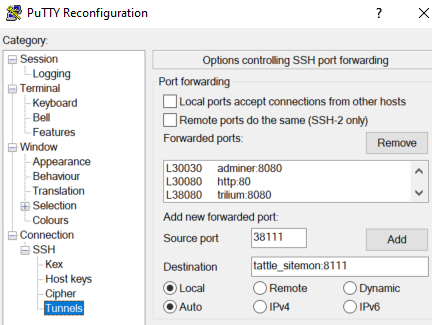

# appbox - run X11 GUI apps and isolated environments from docker containers

### Supported

 - ssh into the container and do what you want.
 - Running X11 apps from the container.
   - "Locally", using the `-v /tmp/.X11-unix:/tmp/.X11-unix` trick.
   - Remotely, using SSH X11 forwarding.

### Not supported

 - Desktop login to the container.  You have to launch your GUI apps. from a
   command line.

### Building

`build.sh` builds user specific images.  I.e. a user with username and user-id
matching the username / user-id on the host are created in the container at
image build time.  In the future maybe the ENTRYPOINT will create required
users on the fly.

To build, run `build.sh`, which creates `_build.sh`, which you can `source` to
actually build the image.  `build.sh` will ask if you need `dzdo` or `sudo` to
run docker, enter nothing if you can run docker without elevated rights.

`_build.sh` will ask (once) for a password for your user inside the container,
type carefully.

### Running

To run appbox as a container you can ssh into, use something like:

```shell
docker run --rm -it -p 2222:22 -v $HOME:$HOME someuser_appbox
```

to access it from the local host (the host running Docker), use

```shell
ssh -p 2222 127.0.0.1
```

but any number of ssh port forwarding steps etc. should work.

### Running X11 apps. locally

For example, there's sometimes a lag before you can get the latest QGis to run
on the latest Ubuntu easily.  So you might want to run QGis from a older Ubuntu
container on a current Ubuntu host.  To install your app. in the image, you can
either edit the main appbox Dockerfile, or you can use someuser_appbox as the
FROM target in a new Dockerfile.  If, as in the QGis example, you need to
change the image's Ubuntu version, you'll need to edit the mane appbox
Dockerfile.  When your app is installed, you can use the `_runX11.sh` script
created by `build.sh`.  By default `_runX11.sh` runs an xterm, you can either
change that or launch your app. from the xterm.

### Running X11 apps. remotely via ssh

As with "Running X11 apps. locally", you can either install your app. by
editing the main appbox Dockerfile, or using a second Dockerfile and `FROM
someuser_appbox`.

If you have your container running on `serverA`, you can set up a client like
MobaXTerm on `desktopB` to log in to your container (on port 2222 on `serverA`)
either by setting up an SSH Jump host in MobaXTerm, or just forwarding port
2222 to `serverA` via a regular ssh session and then logging in to your
container via 127.0.0.1 (on `desktopB`) on port 2222.

## Using appbox to run other images behind a SSH tunnel

Build the basic `appbox` as above, and use a docker-compose.yml like the one
below.

Then setup up SSH port forwarding rules like this (PuTTy example):



After `docker-compose up -d` you can SSH to the `appbox` container, at
`example.com:30033` in the example below, and reach the other images
at URLs like `127.0.0.1:30030`, `127.0.0.1:38111` etc.

`timezone.env` should be something like `TZ=America/Chicago`.

```docker-compose
services:

  door:
    env_file:
      - timezone.env
    image: username_appbox
    ports:
      - "30033:22"
    deploy:
      restart_policy:
        condition: any

  adminer:
    env_file:
      - timezone.env
    image: adminer
    environment:
      - ADMINER_DESIGN=dracula
    deploy:
      restart_policy:
        condition: any

  http:
    env_file:
      - timezone.env
    image: httpd:latest
    volumes:
      - /home/username/repo:/usr/local/apache2/htdocs
    deploy:
      restart_policy:
        condition: any

  trilium:
    env_file:
      - timezone.env
    image: zadam/trilium:latest
    volumes:
      - /home/username/trilium-data:/home/node/trilium-data
    deploy:
      restart_policy:
        condition: any

  tattle_sitemon:
    env_file:
      - timezone.env
    image: tattle_sitemon
    volumes:
      - /home/username/repo/tattle_sitemon/data:/data
    deploy:
      restart_policy:
        condition: any
```
